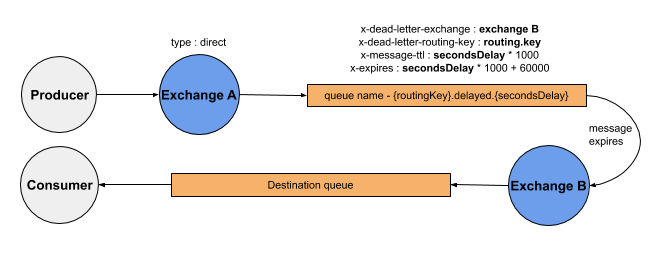

# Message production

### Basics

`IQueueService` represents a service that handles all the work of sending and receiving messages. You can inject `IQueueService` wherever you want in order to use it.

It can be a custom service or a controller.
```c#
[Route("api/[controller]")]
public class HomeController : Controller
{
    private readonly IQueueService _queueService;
    public HomeController(IQueueService queueService)
    {
        _queueService = queueService;
    }
}
```

Or you can get the instance of singleton `IQueueService` in a console application.

```c#
public static class Program
{
    public static IConfiguration Configuration { get; set; }

    public static void Main()
    {
        var builder = new ConfigurationBuilder()
            .SetBasePath(Directory.GetCurrentDirectory())
            .AddJsonFile("appsettings.json", optional: false, reloadOnChange: true);
        Configuration = builder.Build();

        var serviceCollection = new ServiceCollection()
            .AddRabbitMqClient(Configuration.GetSection("RabbitMq"))
            .AddConsumptionExchange("exchange.name", Configuration.GetSection("RabbitMqExchange");

        var serviceProvider = serviceCollection.BuildServiceProvider();
        var queueService = serviceProvider.GetRequiredService<IQueueService>();
        // And you can use the IQueueService as you want.
    }
}
```

To publish a message to an exchange, use one of the `IQueueService` sending methods.

You can send objects using `Send` or `SendAsync` methods. Objects will be serialized into json and sent with `IBasicProperties` where content type set as `"application/json"` and `Persistent` set as `true`. 
```c#
var message = new
{
	Id = 1,
	Name = "RandomName"
};
queueService.Send(message, exchangeName: "exchange.name", routingKey: "routing.key");
// Or asyncronous version
await queueService.SendAsync(message, exchangeName: "exchange.name", routingKey: "routing.key");
```

With `SendJson` methods you can also send raw json in case you serialized it by yourself.

```c#
var message = "{\"id\": 1, \"name\": \"Bob\"}";
queueService.SendJson(message, exchangeName: "exchange.name", routingKey: "routing.key");
// Or asyncronous version
await queueService.SendJsonAsync(message, exchangeName: "exchange.name", routingKey: "routing.key");
```

If you want to send a message in another format different from json you can use `SendString` methods.
In this case `IBasicProperties` will be only with `Persistent` property set as `true`, so you can send any string you want (e.g. an XML string).

```c#
var message = "<?xml version="1.0" encoding="UTF-8"?><message>Hello World!</message>";
queueService.SendString(message, exchangeName: "exchange.name", routingKey: "routing.key");
// Or asyncronous version
await queueService.SendStringAsync(message, exchangeName: "exchange.name", routingKey: "routing.key");
```

And if you want to manage everything by yourself you can use `Send` methods passing message as byte array and `IBasicProperties` as parameters.
```c#
var properties = queueService.Channel.CreateBasicProperties();
// Set everything you want.
properties.Persistent = true;

var bytes = new byte[] { 72, 101, 108, 108, 111, 32, 119, 111, 114, 108, 100, 33 };
queueService.Send(bytes, properties, exchangeName: "exchange.name", routingKey: "routing.key");
// Or asyncronous version
await queueService.SendAsync(bytes, properties, exchangeName: "exchange.name", routingKey: "routing.key");
```

You are also allowed to send messages with delay (in seconds). All of the previously listed methods have an overload that takes delay parameter.
```c#
// Objects
queueService.Send(message, exchangeName: "exchange.name", routingKey: "routing.key", secondsDelay: 10);
await queueService.SendAsync(message, exchangeName: "exchange.name", routingKey: "routing.key", secondsDelay: 10);

// Json
queueService.SendJson(message, exchangeName: "exchange.name", routingKey: "routing.key", secondsDelay: 10);
await queueService.SendJsonAsync(message, exchangeName: "exchange.name", routingKey: "routing.key", secondsDelay: 10);

// Strings
queueService.SendString(message, exchangeName: "exchange.name", routingKey: "routing.key", secondsDelay: 10);
await queueService.SendStringAsync(message, exchangeName: "exchange.name", routingKey: "routing.key", secondsDelay: 10);

// Bytes
queueService.Send(bytes, properties, exchangeName: "exchange.name", routingKey: "routing.key", secondsDelay: 10);
await queueService.SendAsync(bytes, properties, exchangeName: "exchange.name", routingKey: "routing.key", secondsDelay: 10);
```

### Mechanism of sending delayed messages



For the exchange configuration see the [Previous page](exchange-configuration.md) <br>
For message consumption features see the [Next page](message-consumption.md)